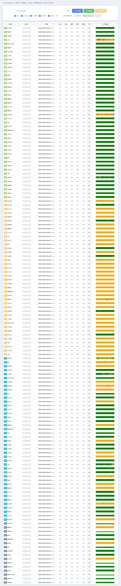
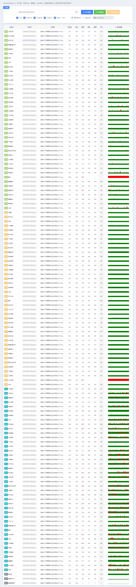

# 搬瓦工迪拜机房实测：2C/1G/20G配置年付$158.48，中东外贸建站新选择

---

最近测试了一台搬瓦工的迪拜 AEDXB_1 机房服务器，这是市面上**非常少见**的中东地区机器。对于做中东外贸的朋友来说，这可能是个不错的选择——毕竟离客户近了，访问速度自然快。不过说实话，这个机房还有些需要注意的地方，咱们一起看看。

测试用的机型是 `SPECIAL 160G KVM PROMO V5 - CN2 GIA ECOMMERCE`，配置挺豪华的：6核CPU、8G内存、160G硬盘、5T流量。当然，一般用户用不着这么高的配置。如果只是想体验迪拜机房，可以考虑入门款 `SPECIAL 20G KVM PROMO V5`，年付$158.48，配置是2核/1G/20G/1T，够日常使用了。

---

## 机房位置和硬件情况

迪拜机房位于阿联酋，地理位置上覆盖中东、北非、南亚这一片区域。有个小遗憾——这个机房还没升级硬件，CPU还是老的 Intel Xeon 处理器。如果你是拿来做外贸建站，处理高并发的话，性能可能稍微弱了点。

不过话说回来，👉 [对于大多数中小型外贸网站和企业应用来说，搬瓦工迪拜机房的性能完全够用](https://bandwagonhost.com/aff.php?aff=79616)，关键是离目标客户近，这点比什么都重要。

---

## 网络表现：绕欧洲，需要中转

这是个比较关键的问题。测试发现，迪拜机房到国内的三网（电信、联通、移动）都要**绕道欧洲**，具体路线是这样的：

**电信回程**：迪拜 → 意大利米兰 → 德国法兰克福 → 回国，延迟280-300ms左右

**联通回程**：迪拜 → 意大利米兰 → 德国法兰克福 → 北京，延迟350-360ms左右

**移动回程**：迪拜 → 意大利米兰 → 瑞典斯德哥尔摩 → 德国法兰克福 → 上海，延迟340-350ms左右

看到这些延迟数字，你就明白了——**直连肯定是不行的**。如果你人在国内，想流畅使用迪拜服务器，最好用香港或者新加坡的机器做个中转，这样体验会好很多。

但换个角度想，如果你的客户主要在中东、印度、巴基斯坦这些地方，那这台机器对他们来说延迟就很低了，访问速度快得很。

---

## 流媒体解锁情况

测试了一圈流媒体解锁，几乎全绿——Netflix、Disney+、HBO这些主流平台都能解锁。不过实话说，应该也没多少人专门买个迪拜服务器看中东地区的流媒体内容吧？

如果你是想解锁流媒体，美国、日本的机房明显更合适。迪拜机房的定位还是**面向中东地区的业务需求**。

---

## IPv6 支持

迪拜机房支持 IPv6，回程路由测试显示：

- 电信 IPv6：绕美国西雅图，延迟400ms+
- 联通 IPv6：绕美国圣何塞，延迟430ms+  
- 移动 IPv6：绕香港，延迟470ms+

IPv6 的延迟比 IPv4 还要高一些，这个表现只能说一般。

---

## 延迟测试数据

从国内各地 Ping 迪拜机房，延迟大概是这样：

- 华东地区：280-300ms
- 华北地区：290-310ms
- 华南地区：270-290ms
- 西南地区：300-320ms

这个延迟对于实时性要求高的应用（比如游戏、视频会议）来说偏高了。但对于网站访问、API调用这类场景，配合CDN使用的话，问题不大。

---

## 同套餐可选机房

买了这个套餐，你可以在后台随时切换到其他机房，包括：

- 美国洛杉矶（DC6 CN2GIA-E、DC9 CN2GIA、DC8 ZNET、DC2 AO）
- 美国圣何塞（CN2GIA-E）
- 美国新泽西、纽约
- 加拿大温哥华（AMD+NVMe、CN2GIA-E）
- 荷兰阿姆斯特丹（AMD+NVMe、联通优化）
- 日本大阪（软银线路）
- **阿联酋迪拜（当前机房）**

这个灵活性还挺不错的，如果发现迪拜不太适合，可以切到其他机房试试。

---

## 适合谁用？

说了这么多，总结一下：

**适合的场景：**
- 中东、北非地区的外贸建站
- 面向印度、巴基斯坦等南亚市场的业务
- 需要中东IP地址的特殊应用
- 测试中东地区的网络环境

**不太适合的场景：**
- 国内直连使用（延迟太高）
- 对实时性要求高的应用
- 纯粹看流媒体（美日机房更好）

如果你正好有中东业务需求，迪拜机房确实是个不错的选择。虽然硬件还没升级，但对于大多数Web应用来说够用了。加上搬瓦工一贯的稳定性和售后服务，👉 [特别是针对中东外贸场景，迪拜机房可以提供更低延迟和更好的用户体验](https://bandwagonhost.com/aff.php?aff=79616)。

价格方面，入门款年付$158.48（2C/1G/20G/1T），折算下来一个月13美元出头，在中东地区的VPS里算是性价比不错的了。
